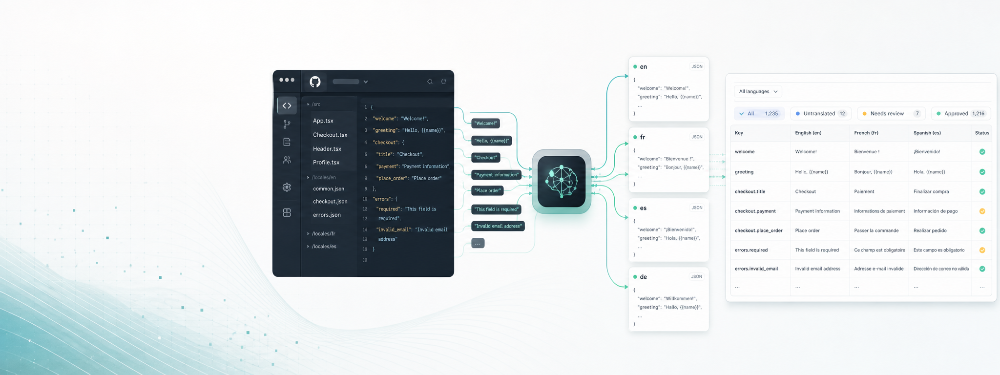

  

# LocaleDock

**AI-first localization for developers, SaaS teams, and WordPress/plugin creators.**

LocaleDock helps product teams ship multilingual software without turning localization into a slow manual workflow. Import strings, translate with AI, review in a clean editor, and sync changes back to code.

## What We Are Building

- Developer-native string import and export for JSON, YAML, PO/POT, PHP arrays, Android XML, and iOS strings.
- AI translation with placeholder preservation, glossary support, and review states.
- GitHub sync that can import changed strings and open pull requests with translated files.
- A simple workflow for small teams that do not need enterprise translation management overhead.
- WordPress localization tooling for plugin and theme developers.

## Product Direction

LocaleDock is not trying to be a feature-for-feature clone of enterprise TMS platforms. The first goal is sharper:

**Make localization feel native to a developer workflow.**

The early product loop is:

1. Import localization files.
2. Choose target languages.
3. Generate AI translations.
4. Review and approve strings.
5. Export files or sync back through GitHub.

## Links

- Website: [localedock.com](https://localedock.com)
- Platform repository: [localedock/platform](https://github.com/localedock/platform)

